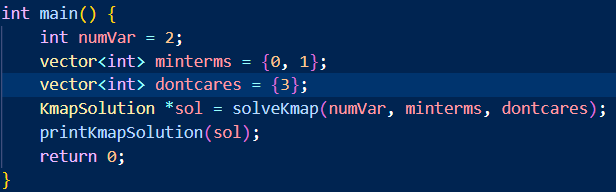

# Kmap Report

**E24126270 蔡承希**

# Flow Chart

.png)

<aside>
📢 我的程式中 numVar=2, 3 的解題流程與 numVar=4 概念上基本相同，此處僅列出numVar=4 的解題流程。

</aside>

## **程式執行流程**

---

1. 將 minterms、dontcare 加入 kmap
    
    ```cpp
    // Put 0, 1, x into Kmap
    kmap = new char *[4];
    for (int r = 0; r < 4; r++) {
        kmap[r] = new char [4];
        for (int c = 0; c < 4; c++) 
            kmap[r][c] = '0';
    } 
    
    for (int i : minterms) 
        kmap[mn4[i][0]][mn4[i][1]] = '1';
    
    for (int i : dontcares) {
        kmap[mn4[i][0]][mn4[i][1]] = 'x';
    }
    ```
    
2. 判斷是否為 edge cases
    - 若 (1 跟 x 的個數和 == 2^numVar) ⇒ 很明顯 primes = essentials = minimumSop = {1}
    - 若 (1 的個數為 0) ⇒ 很明顯 primes = essentials = {}, minimumSop = {0}
    
    ```cpp
    // edge cases
    if (minterms.size() + dontcares.size() == 16) { // all 1
        primes.push_back("1");
        essentials.push_back("1");
        minimumSop.push_back("1");
        KmapSolution *sol = new KmapSolution;
        sol->numVar = numVar;
        sol->kmap = kmap;
        sol->primes = primes;
        sol->essentials = essentials;
        sol->minimumSop = minimumSop;
        return sol;
    }
    if (minterms.size() == 0) { // all 0
        minimumSop.push_back("0");
        KmapSolution *sol = new KmapSolution;
        sol->numVar = numVar;
        sol->kmap = kmap;
        sol->primes = primes;
        sol->essentials = essentials;
        sol->minimumSop = minimumSop;
        return sol;
    }
    ```
    
3. 依序尋找 1x1 → 1x2, 2x1 → 1x4, 4x1, 2x2 → 2x4, 4x2 Implicants
    - 將 kmap 中的 1 和 x 都加入 **_1x1**
    - 若 kmap 中，1x1 的右方亦為 1x1 ⇒ 找到 1x2，加入 **_1x2**
    - 若 kmap 中，1x1 的下方亦為 1x1 ⇒ 找到 2x1，加入 **_2x1**
        
        ```cpp
        // Size 1 :
            // 1x1 Implicants
            for (int i : minterms) _1x1.insert(make_pair(mn4[i][0], mn4[i][1])); 
            for (int i : dontcares) _1x1.insert(make_pair(mn4[i][0], mn4[i][1]));
        
        // Size 2 :
            // 1x2 Implicants
            for (pair<int,int> p : _1x1) {
                if (kmap[p.first][(p.second+1)%4]=='1' 
        		        || kmap[p.first][(p.second+1)%4]=='x') {
                    _1x2.insert(make_pair(p.first, p.second));
                    _1x1_to_delete.insert(make_pair(p.first, p.second));
                    _1x1_to_delete.insert(make_pair(p.first, (p.second+1)%4));
                }
            }
            
            // 2x1 Implicants
            for (pair<int,int> p : _1x1) {
                if (kmap[(p.first+1)%4][p.second]=='1' 
        		        || kmap[(p.first+1)%4][p.second]=='x') {
                    _2x1.insert(make_pair(p.first, p.second));
                    _1x1_to_delete.insert(make_pair(p.first, p.second));
                    _1x1_to_delete.insert(make_pair((p.first+1)%4, p.second));
                }
            }
        ```
        
    
    <aside>
    💡 最右邊的 column 的右方定義為最左邊的 column，
    最下方的 row 的下方定義為最上方的 row。
    
    </aside>
    
    - 將有成功與其他 1x1 合併成 1x2 或 2x1 的 1x1 從 **_1x1** 中刪去，因為既然它能夠與其他 1x1 合併成更大的 Implicant，那就說明它不會是 Prime Implicant
        
        ```cpp
        // delete 1x1 non-Prime Implicants
        for (pair<int,int> p : _1x1_to_delete) _1x1.erase(p);
        ```
        
    - 若 kmap 中，1x2 的右方亦為 1x2 ⇒ 找到 1x4，加入 **_1x4**
    - 若 kmap 中，2x1 的下放亦為 2x1 ⇒ 找到 4x1，加入 **_4x1**
    - 若 kmap 中，1x2 的下方亦為 1x2 ⇒ 找到 2x2，加入 **_2x2**
        
        ```cpp
        // Size 4 :
        	  // 1x4 Implicants
        	  for (pair<int,int> p : _1x2) {
        	      if (p.second==0 && _1x2.count(make_pair(p.first, 2))) {
        	          _1x4.insert(make_pair(p.first, p.second));
        	          _1x2_to_delete.insert(make_pair(p.first, 0));
        	          _1x2_to_delete.insert(make_pair(p.first, 1)); 
        	          _1x2_to_delete.insert(make_pair(p.first, 2));
        	          _1x2_to_delete.insert(make_pair(p.first, 3)); 
        	      }
        	  }
        	
        	  // 4x1 Implicants
        	  for (pair<int,int> p : _2x1) {
        	      if (p.first==0 && _2x1.count(make_pair(2, p.second))) {
        	          _4x1.insert(make_pair(p.first, p.second));
        	          _2x1_to_delete.insert(make_pair(0, p.second));
        	          _2x1_to_delete.insert(make_pair(1, p.second));
        	          _2x1_to_delete.insert(make_pair(2, p.second));
        	          _2x1_to_delete.insert(make_pair(3, p.second));
        	      }
        	  }
        	
        	  // 2x2 Implicants
        	  for (int r = 0; r < 4; r++) {
        	      for (int c = 0; c < 4; c++) {
        	          if (_1x2.count(make_pair(r,c)) 
        			          && _1x2.count(make_pair((r+1)%4, c))) {
        	              _2x2.insert(make_pair(r,c));
        	              _1x2_to_delete.insert(make_pair(r, c));
        	              _1x2_to_delete.insert(make_pair((r+1)%4, c));
        	              _2x1_to_delete.insert(make_pair(r, c));
        	              _2x1_to_delete.insert(make_pair(r, (c+1)%4));
        	          }
        	      }
        	  }
        ```
        
    - 將有成功與其他 1x2 合併成 1x4 或 2x2 的 1x2 從 **_1x2** 中刪去，因為既然它能夠與其他 1x2 合併成更大的 Implicant，那就說明它不會是 Prime Implicant
    - 將有成功與其他 2x1 合併成 4x1 或 2x2 的 2x1 從 **_2x1** 中刪去，因為既然它能夠與其他 2x1 合併成更大的 Implicant，那就說明它不會是 Prime Implicant
        
        ```cpp
        //delete 1x2 non-Prime Implicants
        for (pair<int,int> p : _1x2_to_delete) _1x2.erase(p);
        
        //delete 2x1 non-Prime Implicants
        for (pair<int,int> p : _2x1_to_delete) _2x1.erase(p);
        ```
        
    - 若 kmap 中，1x4 的下方亦為 1x4 ⇒ 找到 2x4，加入 **_2x4**
        
        ```cpp
        // Size 8 :
        		// 2x4 Implicants
        		for (int r = 0; r < 4; r++) {
        		    if (_1x4.count(make_pair(r, 0)) 
        				    && _1x4.count(make_pair((r+1)%4, 0))) {
        		        _2x4.insert(make_pair(r, 0));
        		        _1x4_to_delete.insert(make_pair(r, 0));
        		        _1x4_to_delete.insert(make_pair((r+1)%4, 0));
        		        _2x2_to_delete.insert(make_pair(r, 0));
        		        _2x2_to_delete.insert(make_pair(r, 1));
        		        _2x2_to_delete.insert(make_pair(r, 2));
        		        _2x2_to_delete.insert(make_pair(r, 3));
        		    }
        		}
        ```
        
    - 將有成功與其他 1x4 合併成 2x4 的 1x4 從 **_1x4** 中刪去，因為既然它能夠與其他 1x4 合併成更大的 Implicant，那就說明它不會是 Prime Implicant
        
        ```cpp
        // delete 1x4 non-Prime Implicants
        for (pair<int,int> p : _1x4_to_delete) _1x4.erase(p);
        ```
        
    - 若 kmap 中，4x1 的右方亦為 4x1 ⇒ 找到 4x2，加入 **_4x2**
        
        ```cpp
        // 4x2 Implicants
        for (int c = 0; c < 4; c++) {
            if (_4x1.count(make_pair(0, c)) 
        		    && _4x1.count(make_pair(0, (c+1)%4))) {
                _4x2.insert(make_pair(0, c));
                _4x1_to_delete.insert(make_pair(0, c));
                _4x1_to_delete.insert(make_pair(0, (c+1)%4));
                _2x2_to_delete.insert(make_pair(0, c));
                _2x2_to_delete.insert(make_pair(1, c));
                _2x2_to_delete.insert(make_pair(2, c));
                _2x2_to_delete.insert(make_pair(3, c));
            }
        }
        ```
        
    - 將有成功與其他 4x1 合併成 4x2 的 4x1 從 **_4x1** 中刪去，因為既然它能夠與其他 4x1 合併成更大的 Implicant，那就說明它不會是 Prime Implicant
    - 將有成功與其他 2x2 合併成 2x4 或 4x2 的 2x2 從 **_2x2** 中刪去，因為既然它能夠與其他 2x2 合併成更大的 Implicant，那就說明它不會是 Prime Implicant
        
        ```cpp
        // delete 4x1 non-Prime Implicants
        for (pair<int,int> p : _4x1_to_delete) _4x1.erase(p);
        
        // delete 2x2 non-Prime Implicants
        for (pair<int,int> p : _2x2_to_delete) _2x2.erase(p);
        ```
        
4. 將所有剩下的 Prime Implicant 加入自訂義類型 PI 的 vector : **primes_non_literals**
    
    <aside>
    💡 PI (Prime Implicant) 之定義如下：
    
    ```cpp
    struct PI {
        int size_r; // PI 的長度
        int size_c; // PI 的寬度
        int row; // PI 最左上角之 minterm 所在列
        int col; // PI 最左上角之 minterm 所在行
    };
    ```
    
    </aside>
    
    ```cpp
    // Size 1 :
        // 1x1 Prime Implicants
        for (pair<int,int> p : _1x1) 
    		    primes_non_literals.push_back({1, 1, p.first, p.second});
    
    // Size 2 :
        // 1x2 Prime Implicants
        for (pair<int,int> p : _1x2) 
    		    primes_non_literals.push_back({1, 2, p.first, p.second});
    
        // 2x1 Prime Implicants
        for (pair<int,int> p : _2x1) 
    		    primes_non_literals.push_back({2, 1, p.first, p.second});
    
    // Size 4 :
        // 1x4 Prime Implicants
        for (pair<int,int> p : _1x4) 
    		    primes_non_literals.push_back({1, 4, p.first, p.second});
    
        // 4x1 Prime Implicants
        for (pair<int,int> p : _4x1) 
    		    primes_non_literals.push_back({4, 1, p.first, p.second});
    
        // 2x2 Prime Implicants
        for (pair<int,int> p : _2x2) 
    		    primes_non_literals.push_back({2, 2, p.first, p.second});
    
    // Size 8 :
        // 2x4 Prime Implicants
        for (pair<int,int> p : _2x4) 
    		    primes_non_literals.push_back({2, 4, p.first, p.second});
    
        // 4x2 Prime Implicants
        for (pair<int,int> p : _4x2) 
    		    primes_non_literals.push_back({4, 2, p.first, p.second});
    
    ```
    
5. 偵測 Prime Implicants 中是否有完全由 dontcare 組成的項，將其從 **primes_non_literals** 中移除。( 若完全由 dontcare 組成，則表示對簡化沒幫助，因此不必視為 Prime Implicant )
    
    ```cpp
    // check if the Prime Implicants is all made of don't care terms
    for (vector<PI>::iterator it = primes_non_literals.begin(); 
    				it != primes_non_literals.end(); it++) {
        bool is_contain_1 = 0;
        PI pi = *it;
        for (int r = 0; r < pi.size_r; r++) {
            for (int c = 0; c < pi.size_c; c++) {
                vector<int> tmp = {(pi.row+r)%4, (pi.col+c)%4};
                if (find(minterms.begin(), minterms.end(), mn4_reverse[tmp]) 
    				            != minterms.end())
                    is_contain_1 = 1;
            }
        }
        if (!is_contain_1) {
            primes_non_literals.erase(it);
            it--;
        }
    }
    ```
    
6. 將 **primes_non_literals** 中所有 PI 型態元素轉換為 Literals 後加入 **primes**
    
    ```cpp
    for (PI pi : primes_non_literals) primes.push_back(PI_to_Literals(4, pi));
    ```
    
    ```cpp
    string PI_to_Literals(int numVar, PI pi) {
        string tmp = "";
        switch(numVar) {
            case 2:
    	          // ...
                break;
            case 3:
                // ...
                break;
            case 4:
                if (pi.size_r==1 && pi.size_c==1) { 
                // 1x1 Essential Prime Implicants
                    tmp += (pi.col<2)? "a\'":"a";
                    tmp += (pi.col==1 || pi.col==2)? "b":"b\'";
                    tmp += (pi.row<2)? "c\'":"c";
                    tmp += (pi.row==1 || pi.row==2)? "d":"d\'"; 
                }
                if (pi.size_r==1 && pi.size_c==2) { 
                // 1x2 Essential Prime Implicants
                    if (pi.col == 0) tmp += "a\'"; // don't care b
                    if (pi.col == 1) tmp += "b"; // don't care a
                    if (pi.col == 2) tmp += "a"; // don't care b
                    if (pi.col == 3) tmp += "b\'"; // don't care a
                    if (pi.row == 0) tmp += "c\'d\'";
                    if (pi.row == 1) tmp += "c\'d";
                    if (pi.row == 2) tmp += "cd";
                    if (pi.row == 3) tmp += "cd\'";
                }
                if (pi.size_r==2 && pi.size_c==1) { 
                // 2x1 Essential Prime Implicants
                    if (pi.col == 0) tmp += "a\'b\'"; 
                    if (pi.col == 1) tmp += "a\'b"; 
                    if (pi.col == 2) tmp += "ab"; 
                    if (pi.col == 3) tmp += "ab\'"; 
                    if (pi.row == 0) tmp += "c\'";
                    if (pi.row == 1) tmp += "d";
                    if (pi.row == 2) tmp += "c";
                    if (pi.row == 3) tmp += "d\'";
                }
                if (pi.size_r==1 && pi.size_c==4) { 
                // 1x4 Essential Prime Implicants
                    if (pi.row == 0) tmp += "c\'d\'"; // don't care ab
                    if (pi.row == 1) tmp += "c\'d"; // don't care ab
                    if (pi.row == 2) tmp += "cd"; // don't care ab
                    if (pi.row == 3) tmp += "cd\'"; // don't care ab
                }
                if (pi.size_r==4 && pi.size_c==1) { 
                // 4x1 Essential Prime Implicants
                    if (pi.col == 0) tmp += "a\'b\'"; 
                    if (pi.col == 1) tmp += "a\'b"; 
                    if (pi.col == 2) tmp += "ab"; 
                    if (pi.col == 3) tmp += "ab\'"; 
                }
                if (pi.size_r==2 && pi.size_c==2) { 
                // 2x2 Essential Prime Implicants
                    if (pi.col == 0) tmp += "a\'"; 
                    if (pi.col == 1) tmp += "b"; 
                    if (pi.col == 2) tmp += "a"; 
                    if (pi.col == 3) tmp += "b\'"; 
                    if (pi.row == 0) tmp += "c\'";
                    if (pi.row == 1) tmp += "d";
                    if (pi.row == 2) tmp += "c";
                    if (pi.row == 3) tmp += "d\'";
                }
                if (pi.size_r==2 && pi.size_c==4) { 
                // 2x4 Essential Prime Implicants
                    if (pi.row == 0) tmp += "c\'";
                    if (pi.row == 1) tmp += "d";
                    if (pi.row == 2) tmp += "c";
                    if (pi.row == 3) tmp += "d\'";
                }
                if (pi.size_r==4 && pi.size_c==2) { 
                // 4x2 Essential Prime Implicants
                    if (pi.col == 0) tmp += "a\'";
                    if (pi.col == 1) tmp += "b";
                    if (pi.col == 2) tmp += "a";
                    if (pi.col == 3) tmp += "b\'";
                }
        }
        return tmp;
    };
    ```
    
7. 建立一個 3D 的 Vector ( vector<vector<vector<PI>>> **find_EPI** )，其中前 2D 為 kmap 的位置資訊，後 1D 為存放所有 cover 到此格的 Prime Implicant。
    
    ```cpp
    // Put all Prime Implicants into a 2D vector to 
    // record which Prime Implicant covers the specific minterm
    		// Size 1 :
    		    // 1x1 Prime Implicants
    		    for (pair<int,int> p : _1x1) {
    		        find_EPI[p.first][p.second].push_back(
    				        {1, 1, p.first, p.second});
    		    }
    		
    		// Size 2 :
    		    // 1x2 Prime Implicants
    		    for (pair<int,int> p : _1x2) {
    		        find_EPI[p.first][p.second].push_back(
    				        {1, 2, p.first, p.second});
    		        find_EPI[p.first][(p.second+1)%4].push_back(
    				        {1, 2, p.first, p.second});
    		    }
    		
    		    // 2x1 Prime Implicants
    		    for (pair<int,int> p : _2x1) {
    		        find_EPI[p.first][p.second].push_back(
    				        {2, 1, p.first, p.second});
    		        find_EPI[(p.first+1)%4][p.second].push_back(
    				        {2, 1, p.first, p.second});
    		    }
    		
    		// Size 4 :
    		    // 1x4 Prime Implicants
    		    for (pair<int,int> p : _1x4) {
    		        for (int c = 0; c < 4; c++) {
    		            find_EPI[p.first][c].push_back(
    				            {1, 4, p.first, p.second});
    		        }
    		    }
    		
    		    // 4x1 Prime Implicants
    		    for (pair<int,int> p : _4x1) {
    		        for (int r = 0; r < 4; r++) {
    		            find_EPI[r][p.second].push_back(
    				            {4, 1, p.first, p.second});
    		        }
    		    }
    		
    		    // 2x2 Prime Implicants
    		    for (pair<int,int> p : _2x2) {
    		        find_EPI[p.first][p.second].push_back(
    				        {2, 2, p.first, p.second});
    		        find_EPI[(p.first+1)%4][p.second].push_back(
    				        {2, 2, p.first, p.second});
    		        find_EPI[p.first][(p.second+1)%4].push_back(
    				        {2, 2, p.first, p.second});
    		        find_EPI[(p.first+1)%4][(p.second+1)%4].push_back(
    				        {2, 2, p.first, p.second});
    		    }
    		
    		// Size 8 :
    		    // 2x4 Prime Implicants
    		    for (pair<int,int> p : _2x4) {
    		        for (int c = 0; c < 4; c++) {
    		            find_EPI[p.first][c].push_back(
    				            {2, 4, p.first, p.second});
    		            find_EPI[(p.first+1)%4][c].push_back(
    				            {2, 4, p.first, p.second});
    		        }
    		    }
    		
    		    // 4x2 Prime Implicants
    		    for (pair<int,int> p : _4x2) {
    		        for (int r = 0; r < 4; r++) {
    		            find_EPI[r][p.second].push_back(
    				            {4, 2, p.first, p.second});
    		            find_EPI[r][(p.second+1)%4].push_back(
    				            {4, 2, p.first, p.second});
    		        }
    		    }
    ```
    
8. 從 **find_EPI** 中找出只有被一個 Prime Implicant cover 到的 minterm，即為 Essential Prime Implicant，加入 **essentials_non_literals** 中，並在 vector<vector<bool>> **covered** 中將其位置之元素改為 1，以表示已 covered。
    
    ```cpp
    // Using that 2D vector to find Essential Prime Implicants
    for (int i : minterms) {
        int r = mn4[i][0];
        int c = mn4[i][1];
        if (find_EPI[r][c].size()==1 && !covered[r][c]) {
            PI tmp_PI = find_EPI[r][c][0];
            essentials_non_literals.push_back(tmp_PI);
            if (tmp_PI.size_r==1 && tmp_PI.size_c==1) // 1x1
                covered[tmp_PI.row][tmp_PI.col] = 1;
            if (tmp_PI.size_r==1 && tmp_PI.size_c==2) { // 1x2
                covered[tmp_PI.row][tmp_PI.col] = 1;
                covered[tmp_PI.row][(tmp_PI.col+1)%4] = 1;
            }
            if (tmp_PI.size_r==2 && tmp_PI.size_c==1) { // 2x1
                covered[tmp_PI.row][tmp_PI.col] = 1;
                covered[(tmp_PI.row+1)%4][tmp_PI.col] = 1;
            }
            if (tmp_PI.size_r==1 && tmp_PI.size_c==4) { // 1x4
                for (int i = 0; i < 4; i++) {
                    covered[tmp_PI.row][i] = 1;
                }
            }
            if (tmp_PI.size_r==4 && tmp_PI.size_c==1) { // 4x1
                for (int i = 0; i < 4; i++) {
                    covered[i][tmp_PI.col] = 1;
                }
            }
            if (tmp_PI.size_r==2 && tmp_PI.size_c==2) { // 2x2
                covered[tmp_PI.row][tmp_PI.col] = 1;
                covered[(tmp_PI.row+1)%4][tmp_PI.col] = 1;
                covered[tmp_PI.row][(tmp_PI.col+1)%4] = 1;
                covered[(tmp_PI.row+1)%4][(tmp_PI.col+1)%4] = 1;
            }
            if (tmp_PI.size_r==2 && tmp_PI.size_c==4) { // 2x4
                for (int i = 0; i < 4; i++) {
                    covered[tmp_PI.row][i] = 1;
                    covered[(tmp_PI.row+1)%4][i] = 1;
                }
            }
            if (tmp_PI.size_r==4 && tmp_PI.size_c==2) { // 4x2
                for (int i = 0; i < 4; i++) {
                    covered[i][tmp_PI.col] = 1;
                    covered[i][(tmp_PI.col+1)%4] = 1;
                }
            }
        }
    }
    ```
    
9. 將 **essentials_non_literals** 中所有 PI 型態元素轉換為 Literals 後加入 **essentials** 和 **minimumSop。**
    
    ```cpp
    // Transfer Essential Prime Implicants into literals 
    // and put them into "essentials"
    for (PI pi : essentials_non_literals) {
        string essential_literals = PI_to_Literals(4, pi);
        essentials.push_back(essential_literals);
        minimumSop.push_back(essential_literals);
    }
    ```
    
10. 尋找是否有仍未被 cover 到的 minterm，若有則尋找包含該 minterm、size 最大的 Prime Implicant 加入 **minimumSop_non_literals**，並在最後將 **minimumSop_non_literals** 中的所有 PI 型態元素轉換為 Literals 後加入 **minimumSop。**
    
    ```cpp
    // Find if need to add other Prime Implicant(s) 
    // to cover the remaining minterm(s)
    for (int i : minterms) {
        if (!covered[mn4[i][0]][mn4[i][1]]) {
            int max_size = 0;
            PI max_size_pi;
            for (PI pi : find_EPI[mn4[i][0]][mn4[i][1]]) {
                if (pi.size_r * pi.size_c >= max_size) {
                    max_size = pi.size_r * pi.size_c;
                    max_size_pi = pi;
                }
            }
            covered[mn4[i][0]][mn4[i][1]] = 1;
            bool is_contained = 0;
            for (PI be_checked_pi : minimumSop_non_literals) {
                if (be_checked_pi.size_r == max_size_pi.size_r 
    		            && be_checked_pi.size_c == max_size_pi.size_c 
    				        && be_checked_pi.row == max_size_pi.row 
    				        && be_checked_pi.col == max_size_pi.col) 
                    is_contained = 1;
            }
            if (!is_contained) minimumSop_non_literals.push_back(max_size_pi);
        } 
    }
    
    for (PI pi : minimumSop_non_literals) 
        minimumSop.push_back(PI_to_Literals(4, pi));
    ```
    

# 2-Var Testcase



1. 將 minterms、dontcare 加入 kmap
2. 確認非 edge cases ( all 1+x or all 0+x )
3. 尋找 1x1 Implicant 並加入 **_1x1** ⇒ (0, 0), (1, 0), (1, 1)
4. 尋找兩個相鄰的 1x1 合成 1x2 並加入 **_1x2**
    - (1, 0) 和 (1, 1) 可合併為 1x2 的 (1, 0)
5. 尋找兩個相鄰的 1x1 合成 2x1 並加入 **_2x1**
    - (0, 0) 和 (1, 0) 可合併為 2x1 的 (0, 0)
6. 因 1x1 的 (0, 0), (1, 0), (1, 1) 皆可被使用合成為 1x2 或 2x1，因此皆非 Prime Implicants，從 **_1x1** 中刪除。

7. 將目前所有 Prime Implicant ( 1x2 的 (1, 0)、2x1 的 (0, 0) ) 轉換為 PI 類型後加入 **primes_non_literals**
    - 1x2 的 (1, 0) ⇒ {1x2, (1, 0)}
    - 2x1 的 (0, 0) ⇒ {2x1, (0, 0)}
8.. 確認是否有 Prime Implicant 全由 dontcare 組成 (檢查是否包含 minterm)：
    - {1x2, (1, 0)} 包含 minterm 位於 (1, 0)，因此並非全由 dontcare 組成
    - {2x1, (0, 0)} 包含 minterm 位於 (0, 0)，因此並非全由 dontcare 組成
    
    ⇒ 不須刪除任何 Prime Implicant
    
3. 將所有 **primes_non_literals** 的元素經 PI_to_Literals 函數轉換為 literals 並加入 **primes**
    - {1x2, (1, 0)} ⇒ b
    - {2x1, (0, 0)} ⇒ a’
    
    ⇒ **primes** = {”b”, “a\’”}
    
4. 將所有 minterm 所被包圍到的所有 Prime Implicant 資訊加入 **find_EPI**
    
    
    | {2x1, (0,0)} | {} |
    | --- | --- |
    | {2x1, (0,0)}
    {1x2, (1, 0)} | {1x2, (1, 0)} |
5. 將 **find_EPI** 中所有 **minterm (dontcare 不用)** 一一檢查，若有 minterm 只包含一個 Prime Implicant，則該 Prime Implicant 為 Essential Implicant，將其加入 **essentials_non_literals**
    - **find_EPI**[0][0] 只有 {2x1, (0, 0)} 這個 Prime Implicant ⇒ 將 {2x1, (0, 0)} 加入 **essentials_non_literals**，並將該 Essential Prime Implicant 所 cover 的位置在 **covered** 改為 1
    - **find_EPI**[1][1] 雖然只有 {1x2, (1, 0)} 這個 Prime Implicant，但非 minterm 所以不動作
    
    ⇒ **essentials_non_literals** = {{2x1, (0, 0)}}
    
6. 將所有 **essentials_non_literals** 的元素經 PI_to_Literals 函數轉換為 literals 並加入 **essentials** 和 **minimumSop**
    - {2x1, (0,0)} ⇒ a’
    
    ⇒ **essentials** = **minimumSop** = {”a\’”}
    
7. 尋找是否有未被 cover 到的 minterm，若有則尋找包含該 minterm、size 最大的 Prime Implicant 加入 **minimumSop_non_literals**，並在最後將 **minimumSop_non_literals** 中的所有 PI 型態元素轉換為 Literals 後加入 **minimumSop：**
    - covered[0][0] == 1 ⇒ (0, 0) 已被 cover
    - covered[1][0] == 1 ⇒ (1, 0) 已被 cover
    
    ⇒ 所有 minterm 已被 covered
    
8. 結束，回傳答案 !

# 3-Var Testcase


1. 將 minterms、dontcare 加入 kmap
2. 確認非 edge cases ( all 1+x or all 0+x )
3. 尋找 1x1 Implicant 並加入 **_1x1** ⇒ (0, 0), (0, 1), (1, 0), (1, 1), (1, 2)
4. 尋找兩個相鄰的 1x1 合成 1x2 並加入 **_1x2**
    - (0, 0) 和 (0, 1) 可合併為 1x2 的 (0, 0)
    - (1, 0) 和 (1, 1) 可合併為 1x2 的 (1, 0)
    - (1, 1) 和 (1, 2) 可合併為 1x2 的 (1, 1)
5. 尋找兩個相鄰的 1x1 合成 2x1 並加入 **_2x1**
    - (0, 0) 和 (1, 0) 可合併為 2x1 的 (0, 0)
    - (0, 1) 和 (1, 1) 可合併為 2x1 的 (0, 1)

1. 因 1x1 的 (0, 0), (0, 1), (1, 0), (1, 1), (1, 2) 皆可被使用合成為 1x2 或 2x1，因此皆非 Prime Implicants，從 **_1x1** 中刪除。
2. 尋找兩個相鄰的 1x2 合成 1x4 並加入 **_1x4**
    
    ⇒ 無符合此條件的兩個 1x2 
    
3. 尋找兩個相鄰的 1x2 合成 2x2 並加入 **_2x2**
    - (0, 0) 和 (1, 0) 可合併為 2x2 的 (0, 0)
4. 因 1x2 的 (0, 0), (1, 0) 和 2x1 的 (0, 0), (0 ,1)皆可被使用合成為 1x4 或 2x2，因此皆非 Prime Implicants，從 **_1x4** 或 **_2x2** 中刪除。
5. 將目前所有 Prime Implicant 轉換為 PI 類型後加入 **primes_non_literals**
    - 1x2 的 (1, 1) ⇒ {1x2, (1, 1)}
    - 2x2 的 (0, 0) ⇒ {2x2, (0, 0)}
6. 確認是否有 Prime Implicant 全由 dontcare 組成 (檢查是否包含 minterm)：
    - {1x2, (1, 1)} 包含 minterm 位於 (1, 1)，因此並非全由 dontcare 組成
    - {2x2, (0, 0)} 包含 minterm 位於 (0, 0)，因此並非全由 dontcare 組成
    
    ⇒ 不須刪除任何 Prime Implicant
    
7. 將所有 **primes_non_literals** 的元素經 PI_to_Literals 函數轉換為 literals 並加入 **primes**
    - {1x2, (1, 1)} ⇒ bc
    - {2x2, (0, 0)} ⇒ a’
    
    ⇒ **primes** = {”bc”, “a\’”}
    
8. 將所有 minterm 所被包圍到的所有 Prime Implicant 資訊加入 **find_EPI**
    
    
    | {2x2, (0, 0)} | {2x2, (0, 0)} | {} | {} |
    | --- | --- | --- | --- |
    | {2x2, (0, 0)} | {2x2, (0, 0)}, {1x2, (1, 1)} | {1x2, (1, 1)} | {} |
9. 將 **find_EPI** 中所有 **minterm (dontcare 不用)** 一一檢查，若有 minterm 只包含一個 Prime Implicant，則該 Prime Implicant 為 Essential Implicant，將其加入 **essentials_non_literals**
    - **find_EPI**[0][0] 只有 {2x2, (0, 0)} 這個 Prime Implicant ⇒ 將 {2x2, (0, 0)} 加入 **essentials_non_literals**，並將該 Essential Prime Implicant 所 cover 的位置在 covered 改為 1
    - **find_EPI**[0][1] 已被 covered，所以不用檢查 ( **covered**[0][1]==**covered**[1][0]==1 )
    - **find_EPI**[1][0] 雖然只有 {2x2, (0, 0)} 這個 Prime Implicant，但非 minterm 所以不動作
    - **find_EPI**[1][2] 雖然只有 {1x2, (1, 1)} 這個 Prime Implicant，但非 minterm 所以不動作
    
    ⇒ **essentials_non_literals** = {{2x1, (0,0)}}
    
10. 將所有 **essentials_non_literals** 的元素經 PI_to_Literals 函數轉換為 literals 並加入 **essentials** 和 **minimumSop**
    - {2x2, (0,0)} ⇒ a’
    
    ⇒ **essentials** = **minimumSop** = {”a\’”}
    
11. 尋找是否有未被 cover 到的 minterm，若有則尋找包含該 minterm、size 最大的 Prime Implicant 加入 **minimumSop_non_literals**，並在最後將 **minimumSop_non_literals** 中的所有 PI 型態元素轉換為 Literals 後加入 **minimumSop：**
    - covered[0][0] == 1 ⇒ (0, 0) 已被 cover
    - covered[0][1] == 1 ⇒ (0, 1) 已被 cover
    - covered[1][1] == 1 ⇒ (1, 1) 已被 cover
    
    ⇒ 所有 minterm 已被 covered
    
12. 結束，回傳答案 !

# 4-Var Testcase


1. 將 minterms、dontcare 加入 kmap
2. 確認非 edge cases ( all 1+x or all 0+x )
3. 尋找 1x1 Implicant 並加入 **_1x1** ⇒ (0, 0), (0, 1), (1, 0), (1, 1), (1, 2), (2, 2), (2, 3), (3, 1), (3, 2), (3, 3)
4. 尋找兩個相鄰的 1x1 合成 1x2 並加入 **_1x2**
    - (0, 0) 和 (0, 1) 可合併為 1x2 的 (0, 0)
    - (1, 0) 和 (1, 1) 可合併為 1x2 的 (1, 0)
    - (1, 1) 和 (1, 2) 可合併為 1x2 的 (1, 1)
    - (2, 2) 和 (2, 3) 可合併為 1x2 的 (2, 2)
    - (3, 1) 和 (3, 2) 可合併為 1x2 的 (3, 1)
    - (3, 2) 和 (3, 3) 可合併為 1x2 的 (3, 2)
5. 尋找兩個相鄰的 1x1 合成 2x1 並加入 **_2x1**
    - (0, 0) 和 (1, 0) 可合併為 2x1 的 (0, 0)
    - (0, 1) 和 (1, 1) 可合併為 2x1 的 (0, 1)
    - (1, 2) 和 (2, 2) 可合併為 2x1 的 (1, 2)
    - (2, 2) 和 (3, 2) 可合併為 2x1 的 (2, 2)
    - (2, 3) 和 (3, 3) 可合併為 2x1 的 (2, 3)
    - (3, 1) 和 (1, 1) 可合併為 2x1 的 (3, 1)

1. 因 1x1 的 (0, 0), (0, 1), (1, 0), (1, 1), (1, 2), (2, 2), (2, 3), (3, 1), (3, 2), (3, 3) 皆可被使用合成為 1x2 或 2x1，因此皆非 Prime Implicants，從 **_1x1** 中刪除。
2. 尋找兩個相鄰的 1x2 合成 1x4 並加入 **_1x4**
    
    ⇒ 無符合此條件的兩個 1x2 
    
3. 尋找兩個相鄰的 2x1 合成 4x1 並加入 **_4x1**
    
    ⇒ 無符合此條件的兩個 2x1
    
4. 尋找兩個相鄰的 1x2 合成 2x2 並加入 **_2x2**
    - (0, 0) 和 (1, 0) 可合併為 2x2 的 (0, 0)
    - (2, 2) 和 (3, 2) 可合併為 2x2 的 (2, 2)
5. 因 1x2 的 (0, 0), (1, 0), (2, 2), (3, 2) 和 2x1 的 (0, 0), (0 ,1), (2, 2), (2, 3) 皆可被使用合成為 1x4 或 4x1 或 2x2，因此皆非 Prime Implicants，從 **_1x4** 或 **_4x1** 或 **_2x2** 中刪除。
6. 尋找兩個相鄰的 1x4 合成 2x4 並加入 **_2x4**
    
    ⇒ 無符合此條件的兩個 1x4
    
7. 尋找兩個相鄰的 4x1 合成 4x2 並加入 **_4x2**
    
    ⇒ 無符合此條件的兩個 4x2
    
8. 因無 1x4 或 4x1 或 2x2 可被使用合成為 2x4 或 4x2，因此不須動作。
9. 將目前所有 Prime Implicant 轉換為 PI 類型後加入 **primes_non_literals**
    - 1x2 的 (1, 1) ⇒ {1x2, (1, 1)}
    - 1x2 的 (3, 1) ⇒ {1x2, (3, 1)}
    - 2x1 的 (1, 2) ⇒ {2x1, (1, 2)}
    - 2x1 的 (3, 1) ⇒ {2x1, (3, 1)}
    - 2x2 的 (0, 0) ⇒ {2x2, (0, 0)}
    - 2x2 的 (2, 2) ⇒ {2x2, (2, 2)}
10. 確認是否有 Prime Implicant 全由 dontcare 組成 (檢查是否包含 minterm)：
    - {1x2, (1, 1)} 包含 minterm 位於 (1, 1)，因此並非全由 dontcare 組成
    - {1x2, (3, 1)} 包含 minterm 位於 (3, 1)，因此並非全由 dontcare 組成
    - **{2x1, (1, 2)} 不包含 minterm，因此全由 dontcare 組成**
    - {2x1, (3, 1)} 包含 minterm 位於 (3, 1)，因此並非全由 dontcare 組成
    - {2x2, (0, 0)} 包含 minterm 位於 (0, 0)，因此並非全由 dontcare 組成
    - {2x2, (2, 2)} 包含 minterm 位於 (2, 3)，因此並非全由 dontcare 組成
    
    ⇒ 從 **primes_non_literals** 中刪除 {2x1, (1, 2)}
    
11. 將所有 **primes_non_literals** 的元素經 PI_to_Literals 函數轉換為 literals 並加入 **primes**
    - {1x2, (1, 1)} ⇒ bc’d
    - {1x2, (3, 1)} ⇒ bcd’
    - {2x1, (3, 1)} ⇒ a’bd’
    - {2x2, (0, 0)} ⇒ a’c’
    - {2x2, (2, 2)} ⇒ ac
    
    ⇒ **primes** = {”bc\’d”, “bcd\’”, “a\’bd\’”, “a\’c\’”, “ac”}
    
12. 將所有 minterm 所被包圍到的所有 Prime Implicant 資訊加入 **find_EPI**
    
    
    | {2x2, (0, 0)} | {2x1, (3, 1)}
    {2x2, (0, 0)} | {} | {} |
    | --- | --- | --- | --- |
    | {2x2, (0, 0)} | {1x2, (1, 1)}
    {2x2, (0, 0)} | {1x2, (1, 1)} | {} |
    | {} | {} | {2x2, (2, 2)} | {2x2, (2, 2)} |
    | {} | {1x2, (3, 1)}
    {2x1, (3, 1)} | {1x2, (3, 1)}
    {2x2, (2, 2)} | {2x2, (2, 2)} |
13. 將 **find_EPI** 中所有 **minterm (dontcare 不用)** 一一檢查，若有 minterm 只包含一個 Prime Implicant，則該 Prime Implicant 為 Essential Implicant，將其加入 **essentials_non_literals**
    - **find_EPI**[0][0] 只有 {2x2, (0, 0)} 這個 Prime Implicant ⇒ 將 {2x2, (0, 0)} 加入 **essentials_non_literals**，並將該 Essential Prime Implicant 所 cover 的位置在 covered 改為 1
    - **find_EPI**[1][0] 雖然只有 {2x2, (0, 0)} 這個 Prime Implicant，但非 minterm 所以不動作
    - **find_EPI**[1][2] 雖然只有 {1x2, (1, 1)} 這個 Prime Implicant，但非 minterm 所以不動作
    - **find_EPI**[2][2] 雖然只有 {2x2, (2, 2)} 這個 Prime Implicant，但非 minterm 所以不動作
    - **find_EPI**[2][3] 只有 {2x2, (2, 2)} 這個 Prime Implicant ⇒ 將 {2x2, (2, 2)} 加入 **essentials_non_literals**，並將該 Essential Prime Implicant 所 cover 的位置在 covered 改為 1
    - **find_EPI**[3][3] 已被 covered，所以不用檢查 ( **covered**[3][3]==1 )
    
    ⇒ **essentials_non_literals** = {{2x2, (0, 0)}, {2x2, (2, 2)}}
    
14. 將所有 **essentials_non_literals** 的元素經 PI_to_Literals 函數轉換為 literals 並加入 **essentials** 和 **minimumSop**
    - {2x2, (0, 0)} ⇒ a’c’
    - {2x2, (2, 2)} ⇒ ac
    
    ⇒ **essentials** = **minimumSop** = {”a\’c\’”, “ac”}
    
15. 尋找是否有未被 cover 到的 minterm，若有則尋找包含該 minterm、size 最大的 Prime Implicant 加入 **minimumSop_non_literals**，並在最後將 **minimumSop_non_literals** 中的所有 PI 型態元素轉換為 Literals 後加入 **minimumSop：**
    - covered[0][0] == 1 ⇒ (0, 0) 已被 cover
    - covered[0][1] == 1 ⇒ (0, 1) 已被 cover
    - covered[1][1] == 1 ⇒ (1, 1) 已被 cover
    - covered[2][3] == 1 ⇒ (2, 3) 已被 cover
    - **covered[3][1] == 0 ⇒ (3, 1) 未被 cover**
    - covered[3][3] == 1 ⇒ (3, 3) 已被 cover
    
    ⇒ (3, 1) 未被 cover，所以尋找所有 cover (3, 1) 的 Prime Implicant，選擇 size 最大的加入 minimumSop
    
    - {1x2, (3, 1)} : size = 2
    - {2x1, (3, 1)} : size = 2
    
    ⇒ 因兩者 size 相同，因此都可為此 kmap 的解，同 size 下我的程式優先選擇最後遇到的 Prime Implicant
    
    ⇒ **minimumSop_non_literals** = {{2x1, (3, 1)}}
    
    ⇒ 將所有 **minimumSop_non_literals** 的元素經 PI_to_Literals 函數轉換為 literals 並加入 **minimumSop**
    
    - {2x1, (3, 1)} ⇒ a’bd’
    
    ⇒ **minimumSop** = {”a\’c\’”, “ac”, “a\’bd\’”}
    
16. 結束，回傳答案 !